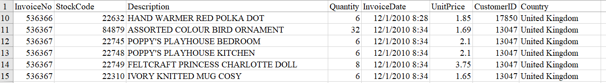
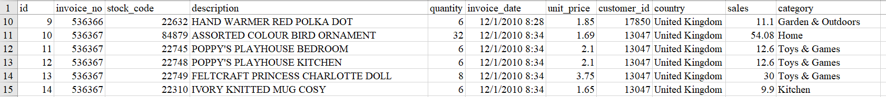

### __Purpose__ 

- Clean and manipulate online retail sales data to fit over 4,000 unique, ambiguously descriptive products into categories using text vectorization and classification techniques
- Create dashboard of category performance considering revenue and time for marketability

##### _Initial Dataset Preview_ 

### __Results__

##### _Categorized Dataset Preview_

##### _Dashboard (Power BI)_

https://app.powerbi.com/view?r=eyJrIjoiMjQxNmFiNzEtYjRkNC00ZGQyLTkzODAtNThhNDQxZjJiOGIxIiwidCI6ImYyZGU2ZDEyLTNkZmItNDk3ZS1hMTE3LTlkODRjNDU5OWZlYiIsImMiOjN9
